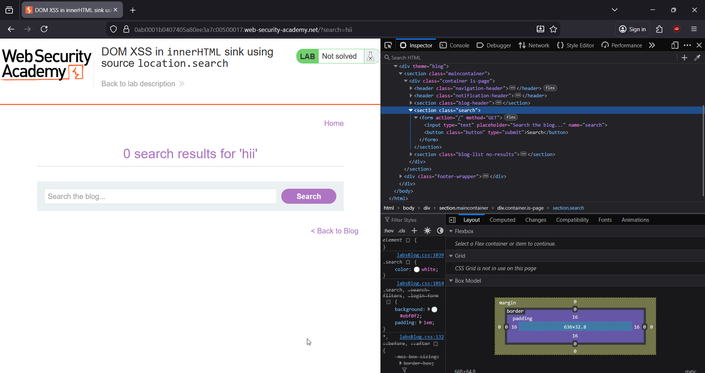
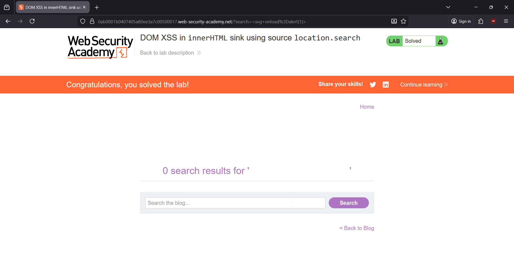
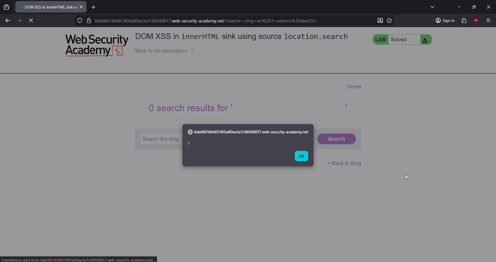
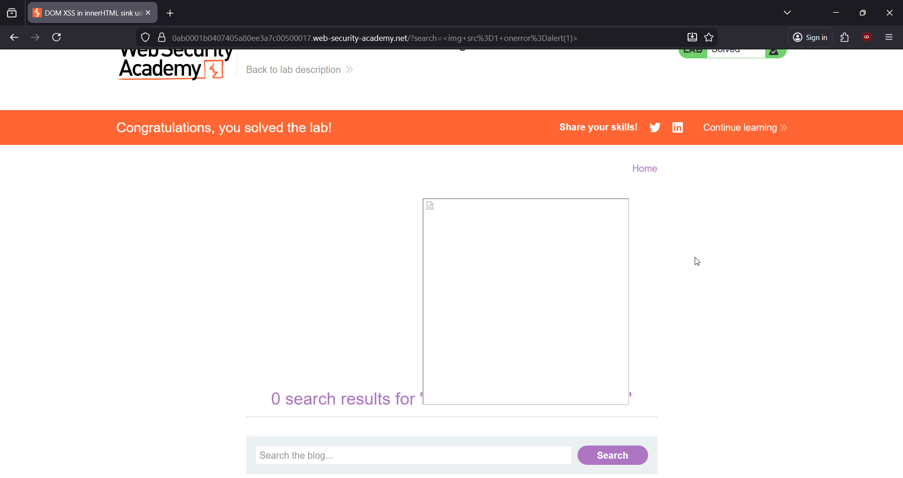

# 🎯 DOM XSS in innerHTML Sink (location.search → innerHTML)

**Write-Up by Aditya Bhatt | DOM-Based XSS | innerHTML Sink | BurpSuite**

Lab Link: [https://portswigger.net/web-security/cross-site-scripting/dom-based/lab-innerhtml-sink](https://portswigger.net/web-security/cross-site-scripting/dom-based/lab-innerhtml-sink)

This PortSwigger lab contains a **DOM-based XSS vulnerability** inside the blog’s search feature.
The JavaScript takes user input from **location.search** and injects it directly into the page using **innerHTML**, making it instantly exploitable.


---

# 🧪 PoC (Step-by-Step with Screenshots)

## **1. Open the Lab website.**

We first load the lab to observe how the search function behaves and how input flows through the DOM.


➤ **Why?**
Understanding the initial page structure helps identify where user-controlled data appears.

---

## **2. Enter any string in the search box and press Enter.**

We start with something harmless like test to see how the application handles reflection.


➤ **Why?**
A baseline request shows how the input appears in the DOM, which is crucial for confirming a sink like innerHTML.

---

## **3. Open Inspect Element to check where the input is inserted.**

The HTML reveals that the search term is directly injected via `innerHTML`, confirming unsafe behavior.



➤ **Why?**
This proves that **location.search → innerHTML**, which is a classic DOM XSS pattern.

---

## **4. Use the payload:**

```
<svg onload=alert(1)>
```

Paste it in the search bar and click Search.



➤ **Why this payload works?**

* `<svg>` is a powerful XSS vector processed by the browser even without visible rendering.
* `onload` executes as soon as the SVG is parsed.
* Since innerHTML interprets input as **real HTML**, the JS engine executes the event handler instantly.

This confirms the DOM XSS vulnerability.

---

## **5. Lab Suggested Payload:**

```

```

This also works.



➤ **Why this payload works?**

* `img` tag attempts to load `src=1`, which is invalid.
* Image loading fails → triggers **onerror** → fires `alert(1)`.

---

## **6. Click OK → Lab Solved 🎉**



---

# 🧠 Payload Explanation (Difference Between Both)

### ✔ **Payload 1: `<svg onload=alert(1)>`**

This payload relies on the fact that SVG elements fire `onload` as soon as the browser parses them.
Perfect for **innerHTML-based DOM XSS**, because the browser immediately executes the event.
 
✓ No need for external resources<br/>
✓ Executes instantly<br/>
✓ Works even in strict CSP in many cases<br/>

### ✔ **Payload 2: ``**

This is PortSwigger’s recommended payload.

* The browser tries to load an image from `1`
* That fails → triggers the `onerror` handler → runs `alert(1)`

This is one of the **most universal and reliable XSS payloads**.

---

### 🔍 Which is better?

| Payload                        | Trigger Type             | Reliability | When To Use                             |
| ------------------------------ | ------------------------ | ----------- | --------------------------------------- |
| `<svg onload=alert(1)>`        | Auto executes on parse   | Very High   | DOM XSS / innerHTML                     |
| `` | Executes on load failure | Very High   | HTML Injection / stored + reflected XSS |

Both are excellent — the SVG payload is preferred for **DOM sinks**, while the IMG payload is preferred for **server-side injection**.

---

# 💰 Real-World Bug Bounty Relevance (Why This XSS Matters)

DOM XSS is highly rewarded in bug bounties because:

### ✔ **Most modern apps rely heavily on client-side JavaScript**

React, Angular, Vue, jQuery — all vulnerable if unsafe sinks are used.

### ✔ **Often bypasses server-side security**

Since it never touches the backend, WAFs & filters rarely detect it.

### ✔ **Stealthy — no server logs**

Perfect for attacks like token extraction.

### ✔ **Common attack vectors**

Attackers send malicious URLs like:

```
victim.com/search?q=
```

---

# ❗ Why DOM XSS Happens

1. **Unsafe JavaScript sinks such as:**

   * innerHTML
   * outerHTML
   * document.write
   * insertAdjacentHTML

2. **Direct use of URL-based sources:**

   * location.search
   * location.hash
   * location.pathname

3. **No sanitization or encoding**
   The browser interprets injected tags as real HTML.

---

# 🛠 How To Fix DOM XSS

### ✔ Use `.textContent` instead of `.innerHTML`

This prevents HTML parsing entirely.

### ✔ Sanitize using libraries like DOMPurify

Removes harmful tags/attributes.

### ✔ Validate/escape dangerous characters

Like `< > " '`.

### ✔ Implement strong Content Security Policy (CSP)

Blocks inline script execution.

---

# 🔥 Final Thoughts

This lab demonstrates how dangerous **innerHTML + location.search** combinations are.
The moment user input is inserted into HTML without sanitization, attackers can execute arbitrary JavaScript.

DOM XSS is fast, silent, reliable, and common — making it a frequent bug bounty target.

Stay offensive. <br/>
— **Aditya Bhatt** 🔥

---
